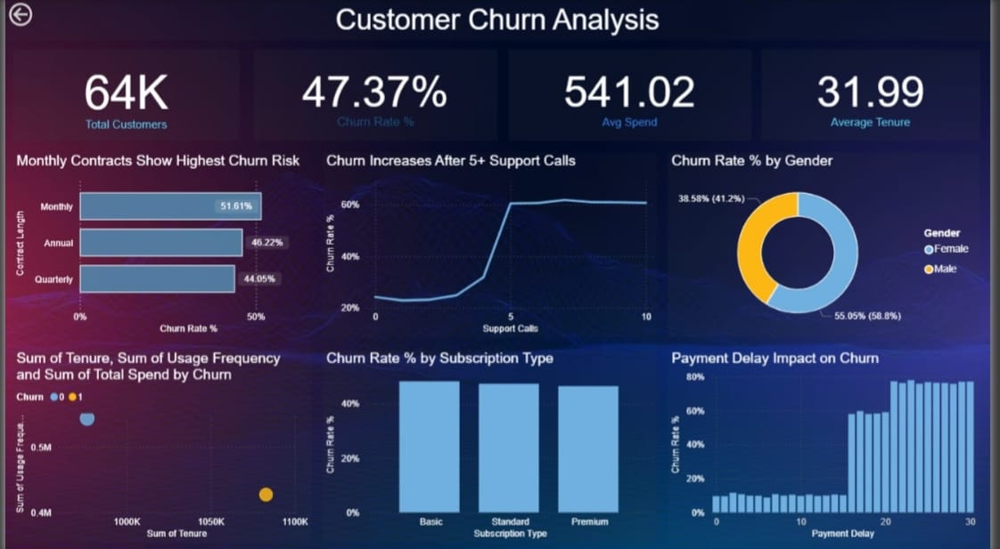

# 📊 Customer Churn Analysis & Retention Strategy

---

## 📌 Project Overview

This project presents a comprehensive **Customer Churn Analysis Dashboard** developed using Power BI to analyze customer behavior, identify churn patterns, and generate actionable business insights.

The goal of this analysis is to **understand key factors influencing customer churn** and provide data-driven recommendations to improve customer retention and business performance.

---

## 🎯 Objectives

- Analyze overall customer churn rate to establish a retention baseline  
- Identify high-risk customer segments based on behavioral and demographic data  
- Evaluate the impact of contract types (Monthly vs Annual vs Quarterly) on churn  
- Understand the relationship between support calls and customer dissatisfaction  
- Analyze the effect of payment delays on customer retention  

---

## 🛠️ Tools & Technologies Used

- Power BI (Dashboard, DAX, Data Modeling)  
- SQL (Data Analysis & Querying)  
- Python (Pandas for Data Cleaning & EDA)  
- Excel (Data preprocessing)  

---

## 📊 Key Business Metrics

| Metric | Value |
|--------|------|
| Total Customers | 64,000 |
| Overall Churn Rate | 47.37% |
| Average Customer Spend | 541.02 |
| Average Customer Tenure | 31.99 months |

---

## 🔍 Key Insights

1. **Contract Type Impact**  
   Customers with monthly contracts exhibit the highest churn rate (51.61%), while annual and quarterly plans demonstrate better retention.

2. **Support Call Influence**  
   Churn probability increases significantly after more than 5 support interactions, indicating dissatisfaction.

3. **Gender-Based Analysis**  
   Minimal variation observed between male and female churn rates, suggesting gender is not a primary factor.

4. **Subscription Type Analysis**  
   Similar churn trends across Basic, Standard, and Premium plans indicate that service experience plays a bigger role than pricing tiers.

5. **Payment Delay Effect**  
   Customers with payment delays exceeding 15–20 days show a significantly higher churn risk.

---

## 💡 Business Recommendations

- Encourage customers to switch from monthly to long-term subscription plans  
- Improve customer support experience to reduce repeated complaints  
- Implement early intervention strategies for customers with frequent support calls  
- Introduce payment reminders and flexible billing options to reduce delays  
- Focus on improving overall service quality rather than pricing strategies  

---

## 🧮 SQL Analysis (Sample Queries)

```sql
-- Churn rate by contract type
SELECT contract_type, AVG(churn_rate) AS churn_rate
FROM customers
GROUP BY contract_type;

-- Churn based on support calls
SELECT support_calls, COUNT(*) AS total_customers
FROM customers
GROUP BY support_calls
ORDER BY support_calls;

-- Payment delay impact
SELECT payment_delay, AVG(churn_rate)
FROM customers
GROUP BY payment_delay;
```

---

## 🐍 Python Analysis (EDA)

- Data cleaning using Pandas  
- Handling missing values  
- Exploratory Data Analysis (EDA)  
- Visualization using Matplotlib / Seaborn  

---

## 📌 Dashboard Features

- KPI Cards (Customers, Churn Rate, Spend, Tenure)  
- Churn analysis by contract type  
- Support call impact visualization  
- Subscription type comparison  
- Payment delay vs churn analysis  
- Interactive filters and drill-down  

---

## 📷 Dashboard Preview



---

## 🎯 Conclusion

This project successfully identifies key drivers of customer churn and provides actionable insights to improve retention strategies. The analysis highlights the importance of contract structure, customer support experience, and payment behavior in influencing churn.
